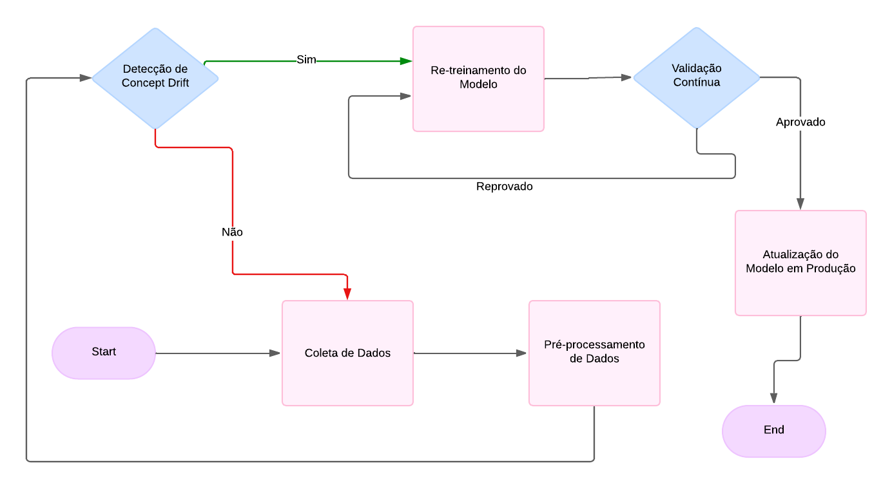

# Ponderada M07 - S6 - Kaiane 

## Barema e instruções
Considerando o paradigma de aprendizado contínuo, faça uma proposta de como fomentar este tipo de atualização no sistema conversacional. A entrega deve ser um arquivo Markdown em repositório GitHub no usuário de cada estudante, em um texto com os seguintes tópicos: Introdução com descrição do problema de falta de atualização de modelos com destaque para o conceito de concept drift, Solução Proposta com um diagrama de blocos e uma descrição textual das responsabilidades de cada bloco, Conclusão com considerações pessoais sobre a proposta e o esforço necessário para possível implementação, e Referências Bibliográficas.

(Alternativa 1) Considerando o paradigma de aprendizado contínuo, faça uma proposta de como fomentar este tipo de atualização no sistema conversacional

(Alternativa 2) Considerando aspectos de segurança, faça uma proposta de como melhorar este requisito não funcional no sistema conversacional

A entrega deve ser um arquivo Markdown em repositório GitHub no usuário de cada estudante, em um texto com os seguintes tópicos:

Introdução com descrição do problema com justificativas e referências em formato ABNT;

Solução Proposta com um diagrama de arquitetura e uma descrição textual das responsabilidades de cada módulo;

Conclusão com considerações pessoais sobre a proposta e o esforço necessário para possível implementação;

Referências Bibliográficas em formato ABNT.
# O paradigma do aprendizado contínuo

## 1. Introdução

### 1.1 Contexto

&emsp;&emsp;A Inteligência Artificial (IA) tem sido teve sua principal aparição a partir da metade do século XX, mas foi apenas nas últimas décadas que ela viu uma significativa aceleração, graças ao avanço rápido da tecnologia e à disponibilidade de grandes volumes de dados. A primeira onda da IA, que começou na década de 1950 e durou até a década de 1980, foi concentrada sistemas que podiam seguir um conjunto de regras pré-programadas para resolver problemas. A partir de então, durante a década de 1990 até os dias atuais, a segunda onda da IA, é caracterizada pelo uso de algoritmos de aprendizado de máquina e redes neurais profundas. Esses algoritmos permitem que sistemas aprendam e melhorem com a experiência, analisando grandes volumes de dados e identificando padrões. Esse avanço teve como consequência uma melhora no desempenho dos sistemas de IA e tornou-os aplicáveis a uma série de tarefas, desde reconhecimento de imagem até chatbots de sistema conversacional, como por exemplo, o Chat GPT (Open AI) e o IBM Watson Assistant.

&emsp;&emsp;Nesse contexto, os dados mencionados são de extrema importância. São eles que treinam e guiam as IAs, por meio dos algorítimos dessa tecnologia. Durante a fase atual do aprendizado de máquina, fazendo o recorte sobre os chatbots, esses sistemas conversacionais fazem perguntas e respondem de maneira naturalista graças aos dados de treinamento em que foram baseados. O processamento de linguagem natural (PLN) atua diretamente nesse cenário, sendo responsável por analisar, compreender e gerar respostas em linguagem natural, tornando as interações entre humanos e máquinas mais fluentes e parecidas com conversas reais.

### 1.2 Descrição do problema 

&emsp;&emsp;Considerando como essas soluções operam, é evidente que os dados de treinamento desempenham um papel fundamental na eficácia dos sistemas conversacionais. Modelos de inteligência artificial, especialmente em processamento de linguagem natural, são dependentes da qualidade e relevância dos dados com os quais foram treinados. Entretanto, à medida que o tempo passa, a linguagem, os padrões de comportamento e as informações mudam. Se esses sistemas não forem continuamente atualizados, podem tornar-se obsoletos e desatualizados, resultando em respostas imprecisas e inconsistentes, o que não apenas prejudica a experiência do usuário, mas também pode gerar erros que culminam em desinformação ou perda de confiança. Portanto, a manutenção regular, com ajustes e re-treinamentos dos modelos, é crucial para assegurar que o sistema continue a fornecer informações corretas e relevantes, mantendo-se alinhado com as mudanças contextuais e necessidades emergentes dos usuários.

&emsp;&emsp;Esse problema está relacionado ao fenômeno conhecido como *concept drift*, comum em sistemas de aprendizado de máquina. O *concept drift* ocorre quando a distribuição subjacente dos dados ou a relação entre as variáveis preditoras e a variável alvo muda ao longo do tempo, afetando o desempenho dos modelos. Em outras palavras, o "conceito" que o modelo aprendeu com os dados de treinamento pode se deslocar, ou "driftar", à medida que novos padrões ou dados surgem, tornando o modelo menos preciso ou até irrelevante para fazer previsões com os dados atuais. Essa degradação no desempenho destaca a necessidade de estratégias de monitoramento contínuo e re-treinamento dos modelos, a fim de garantir que eles possam se adaptar dinamicamente a mudanças nos padrões de dados, minimizando os impactos negativos no desempenho e na confiabilidade do sistema.

## 2. Solução Proposta

### 2.1 O Aprendizado Contínuo

&emsp;&emsp;Uma maneira eficaz de lidar com o problema representado pelo *concept drift* é a implementação do aprendizado contínuo. Nesse modelo, o sistema é projetado para utilizar os dados que entraram no banco de dados da solução e monitorar continuamente as informações de entrada, além de identificar mudanças na distribuição dos dados ou padrões ao longo do tempo. Ao invés de ser treinado apenas uma vez e permanecer estático, o aprendizado contínuo permite que o modelo seja atualizado constantemente com novos dados. Isso não só corrige a degradação causada pelo *drift*, como também melhora a capacidade do sistema de generalizar e responder adequadamente a novas situações.  

&emsp;&emsp;No pipeline de aprendizado contínuo, as etapas de re-treinamento são cuidadosamente orquestradas para serem ativadas sempre que mudanças significativas nos dados de entrada ou na distribuição dos dados são detectadas. Essa detecção de mudanças, conhecida como *concept drift*, pode ser realizada de diferentes formas, como por monitoramento estatístico das previsões ou comparações entre o desempenho atual e o histórico. Quando um desvio é identificado, o sistema aciona automaticamente o re-treinamento do modelo, utilizando os dados mais recentes para garantir que ele se ajuste aos novos padrões e continue a fazer previsões precisas.

&emsp;&emsp;Além do re-treinamento, o sistema incorpora técnicas de validação contínua. Essa validação é crítica para garantir que as mudanças aplicadas no modelo, após o re-treinamento, não resultem em perda de desempenho em outras áreas ou em dados futuros. Um conjunto de validação separado é usado para testar o novo modelo de forma sistemática, monitorando métricas como acurácia, precisão e recall. Essa abordagem permite que o sistema identifique falhas ou desvios de desempenho antes de implementar o modelo atualizado em produção, evitando riscos de degradação. (Um dos pilares da engenharia de software: testes, testes e testes!!)

&emsp;&emsp;Outra característica importante do pipeline de aprendizado contínuo é a capacidade de realizar atualizações incrementais nos modelos. Ao invés de re-treinar completamente o modelo do zero, o sistema ajusta gradualmente os pesos e parâmetros do modelo, levando em conta as novas evidências trazidas pelos dados mais recentes. Esse processo de aprendizado incremental assegura que as informações aprendidas anteriormente não sejam descartadas, mas sim refinadas e ajustadas. Com isso, o modelo mantém um equilíbrio entre o conhecimento adquirido no passado e as mudanças necessárias para se adaptar às novas condições, o que resulta em maior eficiência computacional e menor risco de sobre-ajuste (overfitting) aos dados mais recentes.

### 2.2 Diagrama de Blocos (de Arquitetura)

&emsp;&emsp;O pipeline de aprendizado contínuo é composto por diversos módulos funcionais, cada um desempenhando um papel crucial na arquitetura do sistema. O primeiro módulo é o de **Coleta de Dados**, responsável por monitorar fontes de dados em tempo real, como interações de usuários e mudanças contextuais no ambiente. Esses dados são capturados continuamente e armazenados em um banco de dados ou em soluções de armazenamento em nuvem, como o Amazon S3, para que possam ser utilizados nas etapas subsequentes do pipeline. Esse processo garante que o sistema esteja sempre atualizado com as informações mais recentes.

&emsp;&emsp;Após a coleta, o módulo de **Pré-processamento de Dados** entra em ação. Os dados brutos passam por uma série de transformações, como limpeza, tokenização e normalização. Além disso, são identificados outliers e valores inesperados que possam comprometer o aprendizado. Esse processamento garante que os dados estejam em um formato adequado para alimentar o modelo de aprendizado de máquina.

&emsp;&emsp;Em seguida, o módulo de **Detecção de *Concept Drift*** desempenha uma função vital no pipeline. Ele monitora continuamente a distribuição dos dados e o desempenho do modelo em produção, utilizando métricas de acurácia e outras estatísticas para identificar mudanças significativas nos padrões de dados. Quando o *concept drift* é detectado, o sistema automaticamente sinaliza que o re-treinamento do modelo é necessário. Esse monitoramento é essencial para garantir que o modelo mantenha sua relevância e precisão ao longo do tempo.

&emsp;&emsp;O próximo passo é o **Re-treinamento do Modelo**. Uma vez identificado o *drift*, o sistema ativa o módulo de re-treinamento, que utiliza os dados mais recentes para ajustar o modelo existente, sem descartar completamente as informações anteriores. Essa abordagem incremental garante que o modelo se adapte às novas evidências sem perder o aprendizado acumulado.

&emsp;&emsp;Após o re-treinamento, o modelo atualizado é submetido ao módulo de **Validação Contínua**. Nesse estágio, o desempenho do novo modelo é testado utilizando um conjunto de dados separado, garantindo que as alterações não comprometam outras áreas do sistema ou levem ao sobre-ajuste (overfitting) nos novos dados. A validação contínua assegura que o modelo mantenha sua robustez e eficácia em diferentes contextos e tipos de dados.

&emsp;&emsp;Por fim, o módulo de **Atualização do Modelo em Produção** implementa o modelo validado no ambiente de produção. Isso envolve substituir o modelo anterior pelo novo, garantindo que todas as previsões e decisões futuras sejam baseadas nos padrões de dados mais recentes. 

  Figura 1: ciclo de aprendizado contínuo
  

Esse diagrama mostra como os dados fluem através do sistema, destacando a interação entre os componentes arquiteturais para garantir um ciclo de aprendizado contínuo. 

## 3. Conclusão
&emsp;&emsp;A proposta de pipeline de aprendizado contínuo oferece uma abordagem eficaz para mitigar o *concept drift*, permitindo que o modelo se ajuste continuamente a novos padrões de dados sem perder informações anteriores. A estrutura modular, com blocos de coleta, pré-processamento, detecção de desvios, re-treinamento e validação contínua, garante que o sistema permaneça atualizado e relevante, além de permitir reconfigurações incrementais conforme necessário. A adoção de soluções em nuvem, como AWS ou GCP, facilita o escalonamento e a integração dessas etapas em ambientes de alta demanda e dados dinâmicos.

&emsp;&emsp;Embora o conceito seja promissor, a implementação exige um esforço significativo, especialmente no que se refere à configuração de técnicas eficientes de detecção de *concept drift* e re-treinamento incremental. A equipe responsável precisaria ter expertise em aprendizado de máquina, processamento de dados em tempo real e manutenção de sistemas distribuídos, além de estar preparada para ajustes contínuos e monitoramento pós-implantação.

### Referências Bibliográficas.
Aqui estão as referências formatadas de acordo com as normas ABNT:

HEYNOW BOTS. *NLU e PNL: o que são e como funcionam?*. Disponível em: <https://heynowbots.com/pt-br/nlu-y-nlp-que-son-y-como-funcionan/>. Acesso em: 16 set. 2024.

TERA BOTS. *Processamento de linguagem natural (NLP): O que é e como funciona?*. Disponível em: <https://blog.somostera.com/data-science/processamento-linguagem-natural-nlp#:~:text=O%20processamento%20de%20linguagem%20natural%20(Natural%20Processing%20Language%20%2D%20NLP),entenderem%20a%20linguagem%20natural%20humana>. Acesso em: 16 set. 2024.

FIT - Instituto de Tecnologia. *Concept drift: Um desafio para modelos de machine learning*. LinkedIn. Disponível em: <https://www.linkedin.com/pulse/concept-drift-um-desafio-para-modelos-de-machinelearning-sbs2f/>. Acesso em: 16 set. 2024.

BERTAN, Érica. *O que é concept drift em machine learning?*. Medium. Disponível em: <https://medium.com/@ericabertan/o-que-%C3%A9-concept-drift-em-machine-learning-40ae3c4f0b67>. Acesso em: 16 set. 2024.